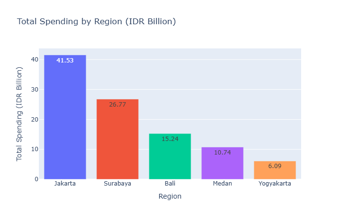
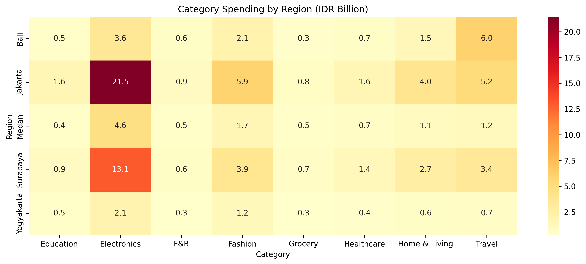
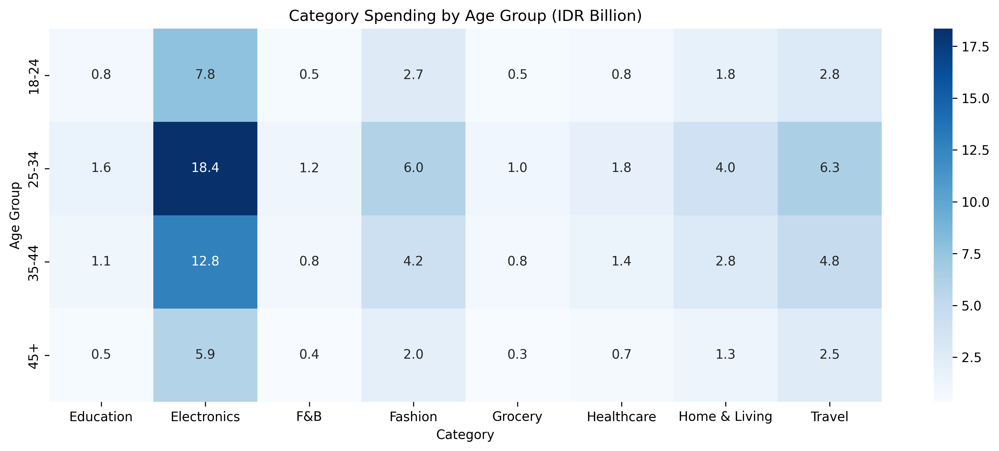
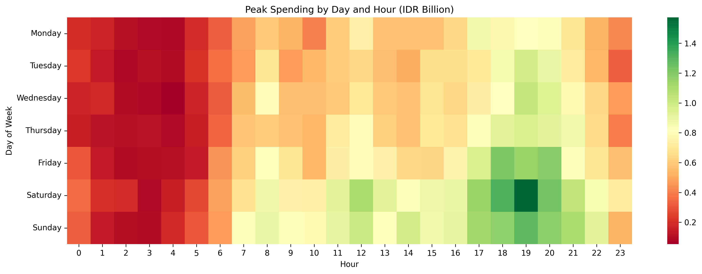
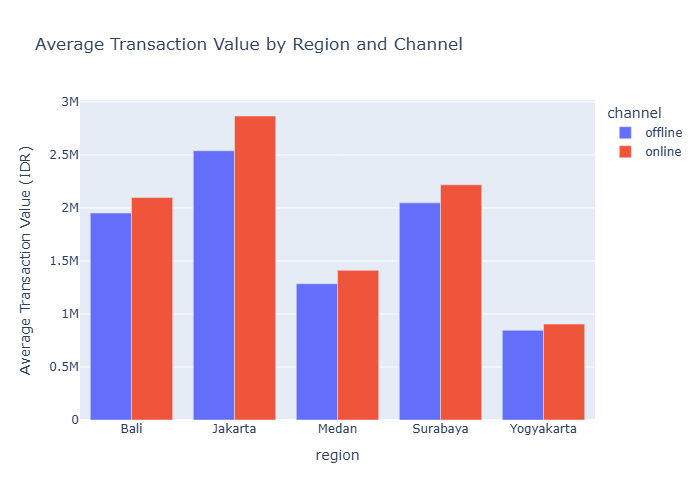

# RegiosAnalysis

An Indonesian consumer behavior analytics dashboard project built with Python, Pandas, Seaborn, Matplotlib, and Plotly. The project simulates regional transaction data across major Indonesian cities and turns it into business-focused visual insights on spending behavior, category preference, timing patterns, and price sensitivity.

## Project Overview

RegiosAnalysis is a portfolio-ready analytics project designed to explore how Indonesian consumers differ across regions, age groups, categories, and purchase channels. It uses a simulated transaction dataset covering Jakarta, Yogyakarta, Surabaya, Medan, and Bali to surface patterns that could support retail, F&B, marketplace, or consumer-tech decision-making.

## Business Context

Indonesia is a diverse consumer market where purchasing behavior varies strongly by geography, demographic profile, and channel adoption. This project aims to mimic real-world market research workflows by combining transaction simulation, exploratory analysis, data visualization, and business recommendations in a single notebook-driven dashboard project.

## Dashboard Preview

### Regional Spending Breakdown



This chart shows total transaction value by region, helping identify which regional markets contribute the most overall spending.

### Category Preference by Region



This heatmap shows which product categories are strongest in each region, making it easier to identify localized demand patterns.

### Category Preference by Age Group



This chart helps compare how consumer preferences shift across age bands, especially between younger and older segments.

### Peak Spending by Day and Hour



This heatmap reveals the strongest purchase windows across the week, which is useful for campaign scheduling and promotional timing.

### Price Sensitivity by Region and Channel



This chart compares average transaction value across online and offline channels for each region.

## Sample Data

Below is the structure of the simulated dataset used in this project:

| transaction_id | region | category | amount_idr | timestamp | channel | age_group |
|---|---|---:|---:|---|---|---|
| TXN000001 | Jakarta | Electronics | 2150000 | 2023-03-11 20:14:32 | online | 25-34 |
| TXN000002 | Bali | Travel | 1875000 | 2023-07-22 19:41:05 | online | 35-44 |
| TXN000003 | Yogyakarta | F&B | 32500 | 2023-11-04 12:30:18 | offline | 18-24 |
| TXN000004 | Surabaya | Grocery | 128000 | 2024-01-13 09:25:44 | offline | 35-44 |
| TXN000005 | Medan | Fashion | 456000 | 2024-04-27 19:18:11 | online | 25-34 |

## Key Insights

- Jakarta leads total spending and has the strongest online transaction behavior.
- Yogyakarta shows lower average basket size, suggesting stronger price sensitivity.
- Bali has higher activity in F&B and Travel-related transactions.
- Weekend evenings show the strongest spending concentration.
- Consumers aged 25-34 drive the highest-value transaction patterns.

## Tech Stack

- Python
- Pandas
- NumPy
- Matplotlib
- Seaborn
- Plotly
- Jupyter Notebook

## Repository Structure

```text
RegiosAnalysis/
├── data/
│   ├── generate_data.py
│   └── transactions.csv
├── notebooks/
│   └── RegiosAnalysis.ipynb
├── outputs/
│   ├── chart exports and summary csv files
├── requirements.txt
├── .gitignore
└── README.md
```

## How to Run

### 1. Clone the repository

```bash
git clone https://github.com/your-username/RegiosAnalysis.git
cd RegiosAnalysis
```

### 2. Install dependencies

```bash
pip install -r requirements.txt
```

### 3. Generate the dataset

```bash
python "D:\MOST IMPORTANT\RegiosAnalysis\data\generate_data.py"
```

If your local folder path is different, update the absolute path in the script before running it.

### 4. Launch Jupyter Notebook

```bash
jupyter notebook notebooks/
```

Then open the notebook and run the cells in order.

## Outputs

The `outputs/` folder contains:

- PNG chart exports for README preview
- Interactive Plotly HTML charts
- CSV summary tables for further analysis

## Use Cases

This project can be used as:

- A data analytics portfolio project
- A consumer behavior analysis case study
- A market segmentation demo project
- A dashboard prototype for retail and commerce insights
- A GitHub showcase project for business and data roles

## GitHub Repo Description

Regional consumer behavior analytics dashboard for Indonesia using simulated transaction data, Jupyter Notebook, and Python visualizations. Covers spending patterns, category preferences, peak purchase timing, and price sensitivity across key regions.
